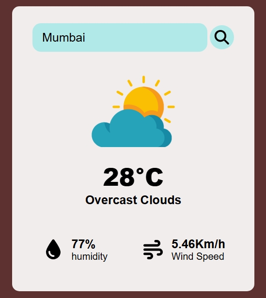
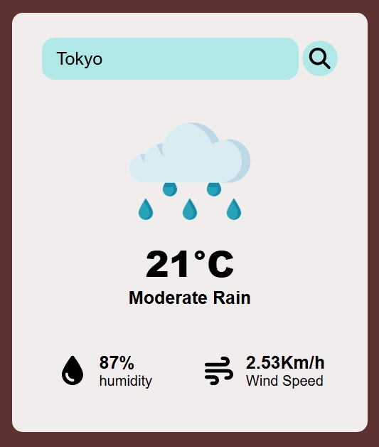
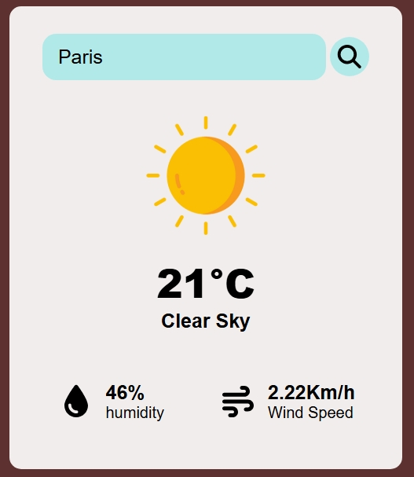
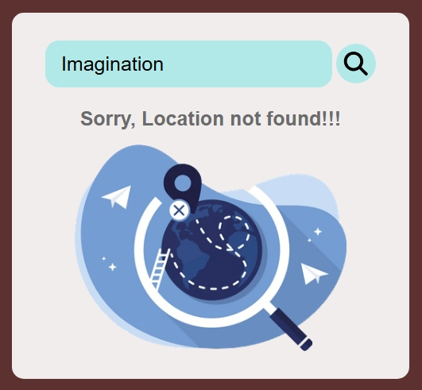

<h1 align="center">🌤️ Weather WedApp</h1>

A simple and responsive weather application built with HTML, CSS, and JavaScript. It uses a weather API to display current weather information.

<table align="center">
  <tr>
    <td></td>
    <td></td>
  </tr>
</table>

## Features

 Temperature

 Humidity

 Wind Speed

 Weather Description

 Dynamic weather images for different conditions

 Responsive design

 ## Built With

HTML5

CSS3

JavaScript

Weather API

 
